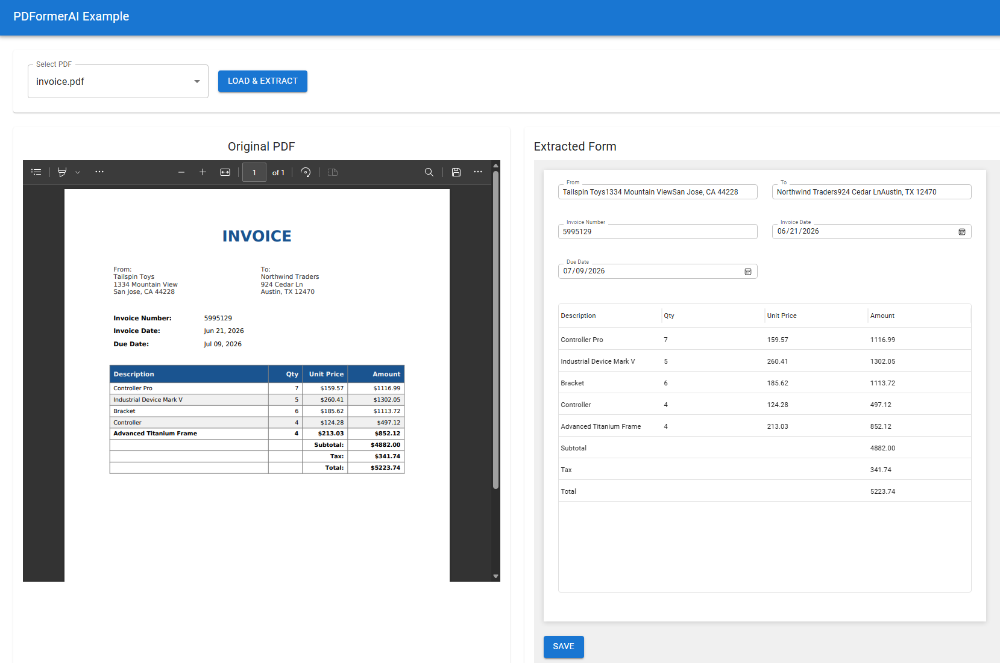
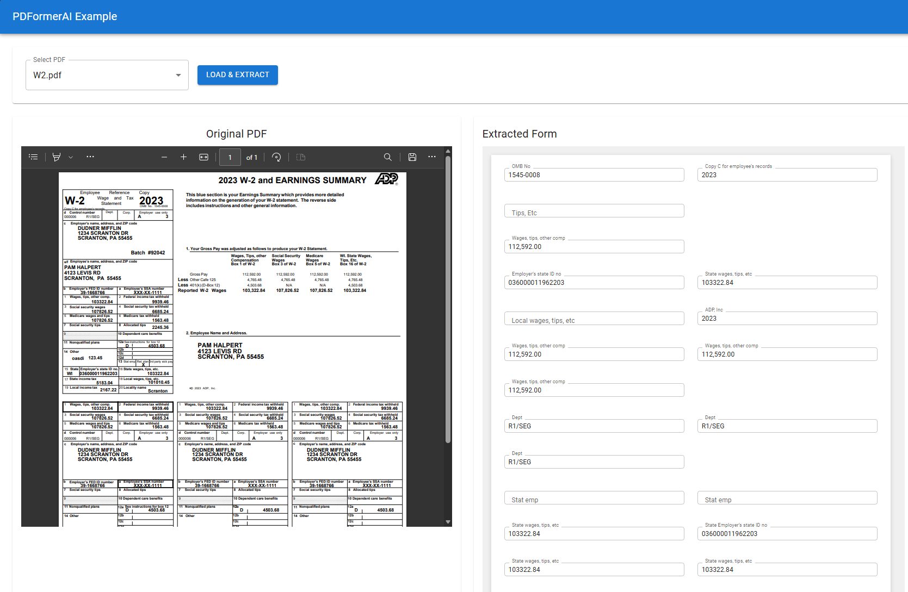

# PDFormerAI

AI-powered PDF form extraction and interactive editing library for React. Extract structured data from PDF forms using OpenAI/Azure OpenAI and render them as editable MUI components.

## Features

- 🤖 **AI-Powered Extraction**: Uses OpenAI/Azure OpenAI to intelligently extract form field values
- 📄 **Layout Detection**: Automatically detects form field positions, types, and labels
- ⚛️ **React Components**: Pre-built MUI components for form editing
- 🎯 **Accurate Positioning**: Renders fields at their exact PDF positions
- 🔧 **Flexible Architecture**: Separate extraction from UI rendering
- ☁️ **Azure OpenAI Ready**: First-class support for Azure OpenAI deployments
- 📦 **TypeScript**: Full type safety and IntelliSense support

## Examples

### Invoice Processing



### W-2 Form Processing



## Installation

```bash
npm install pdformerai
```

### Peer Dependencies

```bash
npm install react react-dom @mui/material @emotion/react @emotion/styled @mui/x-data-grid @mui/x-date-pickers
```

## Architecture

PDFormerAI separates PDF extraction from UI rendering:

1. **`extractPDFSchemaData()`**: Extracts layout and data from PDF (Node.js/backend)
2. **`PDFormerAIEditor`**: React component that renders the extracted data (frontend)

This separation allows you to:

- Run extraction on the server (keeping API keys secure)
- Cache extraction results
- Use external extraction services
- Build custom frontends

## Quick Start

### 1. Extract PDF Data (Backend)

```typescript
import { extractPDFSchemaData, configFromEnv } from "pdformerai";
import { readFile } from "fs/promises";

// Load Azure OpenAI config from environment
const config = configFromEnv(true);

// Extract layout and data
const pdfBuffer = await readFile("form.pdf");
const result = await extractPDFSchemaData(pdfBuffer, config);

// Result contains:
// - result.layout: Field positions, types, labels
// - result.extractedData: Extracted field values
```

### 2. Render in React (Frontend)

```tsx
import { PDFormerAIEditor } from "pdformerai";
import type { ExtractionResult } from "pdformerai";

function MyForm({ result }: { result: ExtractionResult }) {
  const handleSave = (data) => {
    console.log("Saved data:", data);
    // Send to your API
  };

  return (
    <PDFormerAIEditor
      layout={result.layout}
      extractedData={result.extractedData}
      onSave={handleSave}
    />
  );
}
```

## Environment Configuration

### Azure OpenAI (Recommended)

Create a `.env` file:

```env
AZURE_OPENAI_API_KEY=your-api-key
AZURE_OPENAI_ENDPOINT=https://your-resource.openai.azure.com/
AZURE_OPENAI_DEPLOYMENT_ID=gpt-4o
AZURE_OPENAI_API_VERSION=2024-08-01-preview
```

Use in code:

```typescript
import { configFromEnv } from "pdformerai";

const config = configFromEnv(true); // true = Azure
```

### Standard OpenAI

```env
OPENAI_API_KEY=sk-...
OPENAI_MODEL=gpt-4o
```

```typescript
const config = configFromEnv(false); // false = Standard OpenAI
```

### Custom Configuration

```typescript
import { extractPDFSchemaData } from "pdformerai";

const result = await extractPDFSchemaData(pdfBuffer, {
  apiKey: "your-key",
  endpoint: "https://your-endpoint.openai.azure.com/",
  model: "gpt-4o",
  isAzure: true,
  azureDeploymentName: "gpt-4o-deployment",
  azureApiVersion: "2024-08-01-preview",
});
```

## API Reference

### `extractPDFSchemaData(pdfBuffer, config)`

Main extraction function that returns layout and extracted data.

**Parameters**:

- `pdfBuffer`: `ArrayBuffer | Buffer` - PDF file content
- `config`: `PDFormerAIConfig` - OpenAI/Azure OpenAI configuration

**Returns**: `Promise<ExtractionResult>`

```typescript
{
  layout: PDFLayout; // Field positions, types, labels
  extractedData: ExtractedFormData; // Extracted values
}
```

### `configFromEnv(useAzure?)`

Creates configuration from environment variables.

**Parameters**:

- `useAzure`: `boolean` - If true, uses Azure OpenAI env vars. Default: true

**Returns**: `PDFormerAIConfig`

### `PDFormerAIEditor` Component

React component that renders an interactive form from extraction results.

**Props**:

```typescript
{
  layout: PDFLayout;                 // From extractPDFSchemaData
  extractedData: ExtractedFormData;  // From extractPDFSchemaData
  onSave?: (data: ExtractedFormData) => void;  // Save callback
  onError?: (error: Error) => void;  // Error handler
  readOnly?: boolean;                // Disable editing
  scale?: number;                    // PDF scale factor (default: 1.5)
  saveLabel?: string;                // Save button text (default: "Save")
}
```

### `usePDFormerAI(layout, extractedData)`

Headless hook for custom UI implementations.

**Returns**:

```typescript
{
  boundFields: BoundField[];         // Fields with current values
  updateField: (id, value) => void;  // Update a field
  getFormData: () => ExtractedFormData;  // Get current form state
}
```

## Example App

A complete example app is included in the `examples/` directory. It demonstrates:

- PDF viewer on the left, form editor on the right
- Backend API for extraction
- Frontend React app
- Azure OpenAI integration

See [examples/README.md](./examples/README.md) for details.

## Advanced Usage

### Separate Layout and Data Extraction

```typescript
import { extractPDFLayout, OpenAIExtractor } from 'pdformerai';

// Step 1: Extract layout (can be cached)
const layout = await extractPDFLayout(pdfBuffer);

// Step 2: Extract data (can use external service)
const extractor = new OpenAIExtractor(config);
const extractedData = await extractor.extract(pdfBuffer, layout);

// Step 3: Pass to component
<PDFormerAIEditor layout={layout} extractedData={extractedData} />
```

### Custom Extractor

Implement your own extraction logic:

```typescript
import type {
  IFormDataExtractor,
  PDFLayout,
  ExtractedFormData,
} from "pdformerai";

class MyCustomExtractor implements IFormDataExtractor {
  async extract(
    pdfBuffer: ArrayBuffer | Buffer,
    layout: PDFLayout,
  ): Promise<ExtractedFormData> {
    // Your extraction logic here
    return {
      field_id_1: "value1",
      field_id_2: "value2",
    };
  }
}
```

### Read-Only Mode

```tsx
<PDFormerAIEditor
  layout={layout}
  extractedData={extractedData}
  readOnly={true}
/>
```

### Custom Field Rendering

Use the headless hook for complete control:

```tsx
import { usePDFormerAI } from "pdformerai";

function CustomForm({ layout, extractedData }) {
  const { boundFields, updateField, getFormData } = usePDFormerAI(
    layout,
    extractedData,
  );

  return (
    <form>
      {boundFields.map((field) => (
        <MyCustomField
          key={field.slot.id}
          field={field}
          onChange={(value) => updateField(field.slot.id, value)}
        />
      ))}
    </form>
  );
}
```

## Supported Field Types

- ✅ Text fields
- ✅ Number fields
- ✅ Date fields
- ✅ Checkboxes
- ✅ Radio buttons
- ✅ Select dropdowns
- ✅ Tables

## Performance Tips

1. **Cache Layout**: Layout extraction is deterministic, so cache results
2. **Server-Side Extraction**: Run `extractPDFSchemaData` on the server to keep API keys secure
3. **Batch Processing**: Process multiple PDFs in parallel
4. **Scale Factor**: Adjust `scale` prop based on your UI requirements

## Security

⚠️ **Never expose API keys in frontend code**

- Always run `extractPDFSchemaData` on the server
- Use environment variables for API keys
- Never commit `.env` files (already in `.gitignore`)

## TypeScript

Full TypeScript support with exported types:

```typescript
import type {
  PDFLayout,
  ExtractedFormData,
  ExtractionResult,
  PDFormerAIConfig,
  BoundField,
  FieldType,
  FieldValue,
} from "pdformerai";
```

## License

MIT

## Contributing

Contributions welcome! Please open an issue or PR.

## Support

For issues and questions:

- GitHub Issues: [Report a bug](https://github.com/yourusername/pdformerai/issues)
- Documentation: See `examples/` directory for working code
